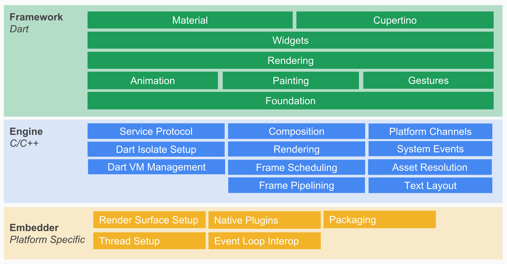
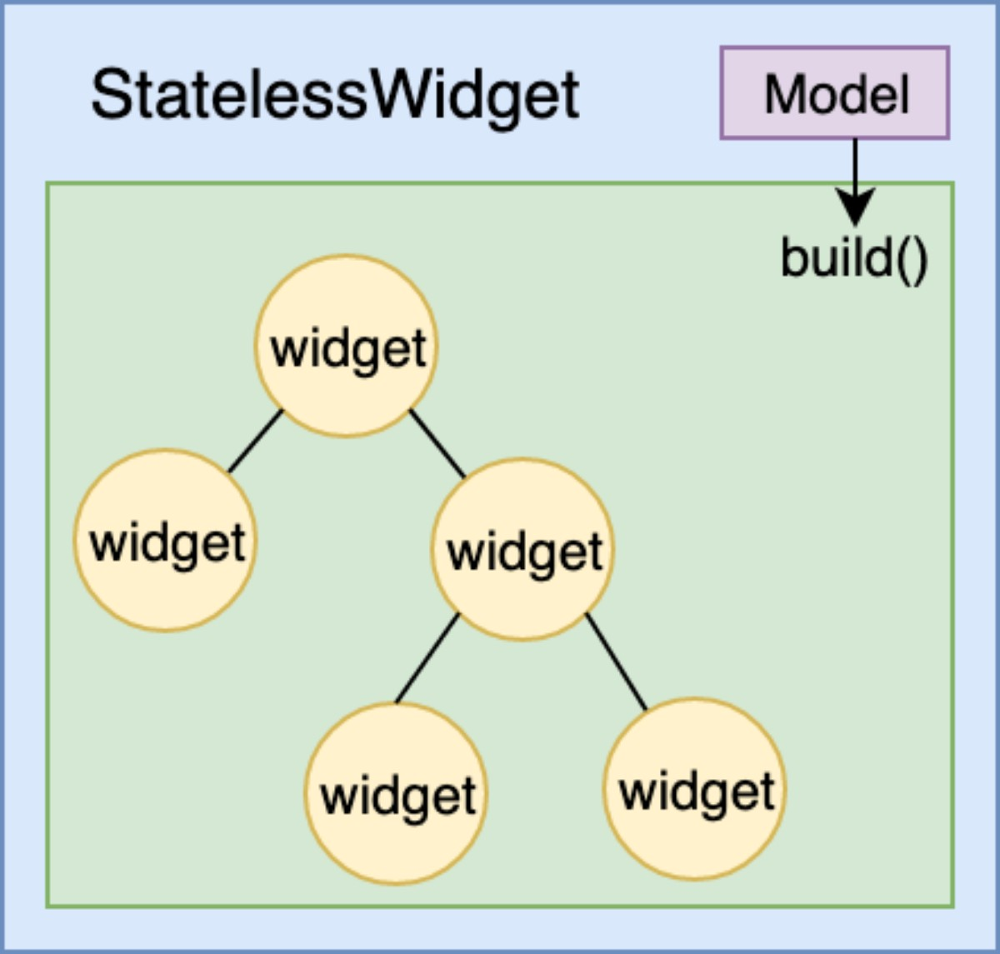
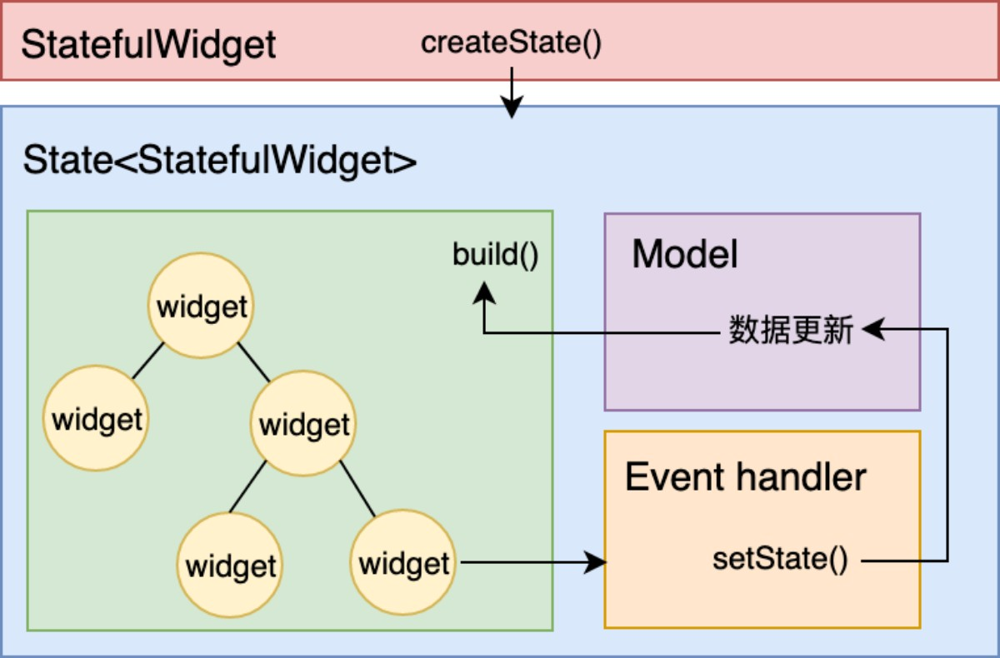
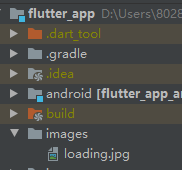

# Flutter
查看运行详情

	flutter run -v
	
## 架构
Flutter 架构采用分层设计，从下到上分为三层，依次为：Embedder、Engine、Framework。

### Embedder 
是操作系统适配层，实现了渲染 Surface 设置，线程设置，以及平台插件等平台相关特性的适配。从这里我们可以看到，Flutter 平台相关特性并不多，这就使得从框架层面保持跨端一致性的成本相对较低。
### Engine 
主要包含 Skia、Dart 和 Text，实现了 Flutter 的渲染引擎、文字排版、事件处理和 Dart 运行时等功能。Skia 和 Text 为上层接口提供了调用底层渲染和排版的能力，Dart 则为 Flutter 提供了运行时调用 Dart 和渲染引擎的能力。而 Engine 层的作用，则是将它们组合起来，从它们生成的数据中实现视图渲染。
### Framework 
则是一个用 Dart 实现的 UI SDK，包含了动画、图形绘制和手势识别等功能。为了在绘制控件等固定样式的图形时提供更直观、更方便的接口，Flutter 还基于这些基础能力，根据 Material 和 Cupertino 两种视觉设计风格封装了一套 UI 组件库。我们在开发 Flutter 的时候，可以直接使用这些组件库。

## 渲染
Flutter把视图数据的组织和渲染抽象为三部分，即 Widget，Element 和 RenderObject。

### Widget 
是 Flutter 世界里对视图的一种结构化描述，你可以把它看作是前端中的“控件”或“组件”。Widget 是控件实现的基本逻辑单位，里面存储的是有关视图渲染的配置信息，包括布局、渲染属性、事件响应信息等。
### Element 
是 Widget 的一个实例化对象，它承载了视图构建的上下文数据，是连接结构化的配置信息到完成最终渲染的桥梁。Element 树这一层将 Widget 树的变化（类似 React 虚拟 DOM diff）做了抽象，可以只将真正需要修改的部分同步到真实的 RenderObject 树中，最大程度降低对真实渲染视图的修改，提高渲染效率，而不是销毁整个渲染视图树重建。
### RenderObject
渲染对象树在 Flutter 的展示过程分为四个阶段，即布局、绘制、合成和渲染。 其中，布局和绘制在 RenderObject 中完成，Flutter 采用深度优先机制遍历渲染对象树，确定树中各个对象的位置和尺寸，并把它们绘制到不同的图层上。绘制完毕后，合成和渲染的工作则交给 Skia 搞定。

## 声明式布局
Flutter 的视图开发是声明式的，其核心设计思想就是将视图和数据分离，这与 React 的设计思路完全一致，Widget 是不可变的，更新则意味着销毁 + 重建（build）。
### StatelessWidget
StatelessWidget 是静态的，一旦创建则无需更新；

### StatefulWidget

对于 StatefulWidget 来说，在 State 类中调用 setState 方法更新数据，会触发视图的销毁和重建，也将间接地触发其每个子 Widget 的销毁和重建。

## 生命周期
### State

#### 创建，
构造方法 -> initState -> didChangeDependencies -> build，随后完成页面渲染。
#### 更新
* setState：我们最熟悉的方法之一。当状态数据发生变化时，我们总是通过调用这个方法告诉 Flutter：“我这儿的数据变啦，请使用更新后的数据重建 UI！”
* didChangeDependencies：State 对象的依赖关系发生变化后，Flutter 会回调这个方法，随后触发组件构建。哪些情况下 State 对象的依赖关系会发生变化呢？典型的场景是，系统语言 Locale 或应用主题改变时，系统会通知 State 执行 didChangeDependencies 回调方法。
* didUpdateWidget：当 Widget 的配置发生变化时，比如，父 Widget 触发重建（即父 Widget 的状态发生变化时），热重载时，系统会调用这个函数。

#### 销毁
* deactivate
* dispose

### App

通过WidgetsBindingObserver中didChangeAppLifecycleState 回调函数中，有一个参数类型为 AppLifecycleState 的枚举类，这个枚举类是 Flutter 对 App 生命周期状态的封装。它的常用状态包括 resumed、inactive、paused 这三个。

* resumed：可见的，并能响应用户的输入。
* inactive：处在不活动状态，无法处理用户响应。
* paused：不可见并不能响应用户的输入，但是在后台继续活动中。

## 跨组件传输数据

* InheritedWidget：主要体现是下层Widget主动去向上层拿数据，实现相对复杂，，缺点传值方向的单一；
* Notification：与InheritedWidget相反，主要体现推数据，针对性强，具体通知给哪个Widget明确，不需要跨多层实现，缺点实现起来相对繁琐点，传值方向单一；
* EventBus：订阅关系，针对性强，全局使用，缺点是不同的事件需要定义不同的实体，传递时要区分哪个事件传递给哪个控件，销毁Widget时不能忘记取消订阅；

## 路由管理
Route 是页面的抽象，主要负责创建对应的界面，接收参数，响应 Navigator 打开和关闭；Navigator 则会维护一个路由栈管理 Route，Route 打开即入栈，Route 关闭即出栈，还可以直接替换栈内的某一个 Route。

* 基本路由。无需提前注册，在页面切换时需要自己构造页面实例。
* 命名路由。需要提前注册页面标识符，在页面切换时通过标识符直接打开新的路由。

页面参数在目标页面通过 RouteSettings 来获取页面参数。

## 依赖管理
可以把资源存放在项目中的任意目录下，只需要使用根目录下的 pubspec.yaml 文件，对这些资源的所在位置进行显式声明就可以了，以帮助 Flutter 识别出这些资源。

Flutter 基于像素密度，设立不同分辨率的目录分开管理，但只需要在 pubspec.yaml 声明一次；而字体则基于样式支持，除了正常字体，还可以支持粗体、斜体等样式。最后，由于 Flutter 需要原生运行环境，因此对于在其启动之前所需的启动图和图标这两类特殊资源，我们还需要分别去原生工程中进行相应的设置。

例如图片在根目录下增加文件夹，在pubspec.yaml下增加声明

	  assets:
	      - images/

### Pub
[https://pub.dev/](https://pub.dev/)来获取可用的第三方包

	dependencies:
	  flutter:
	    sdk: flutter
	
	
	  # The following adds the Cupertino Icons font to your application.
	  # Use with the CupertinoIcons class for iOS style icons.
	  cupertino_icons: ^1.0.0
	  date_format: 1.0.6
	  event_bus: 1.1.0
	
	dev_dependencies:
	  flutter_test:
	    sdk: flutter